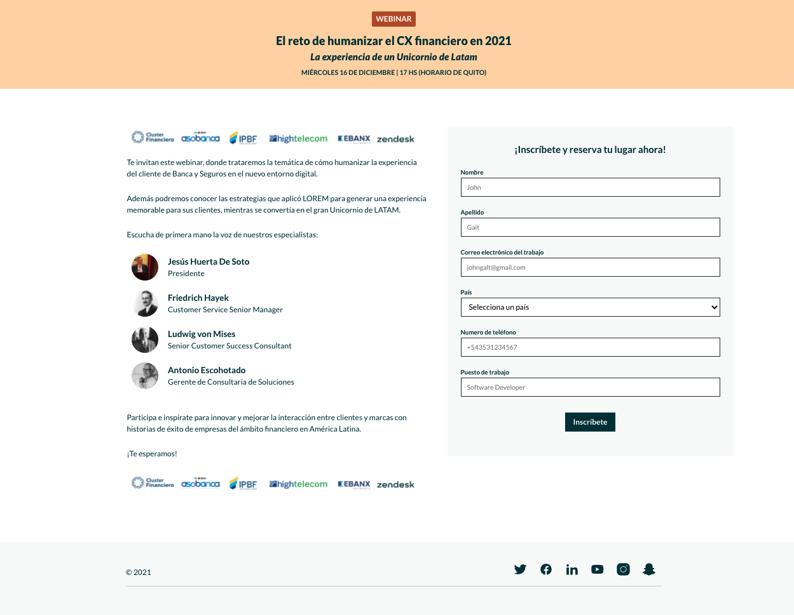

# The 8 Agency - Webinar (client-side)

This application was developed as part of the 8 Agency challenge.

Its a website that allows you to register to a Webinar.

This repo is for the client side of the app and it was developed with React compiled through Webpack.

## Features

You will get an email when you fill the form to join to the Webinar.

If you are an admin you can see the list of the people that have registered to the Webinar:

- Login with your admin acount in /auth
- If you are a valid admin you will get redirected to /auth/backoffice and you will see the list of the people that have registered to the Webinar.
- Download the list of the people that have registered to the Webinar in CSV format.



## Installation and Setup

```
git clone [repo]
cd [repo]
npm install
npm start
```

[Link to server-side repository](https://github.com/bvonpotobsky/the8agency-server)
